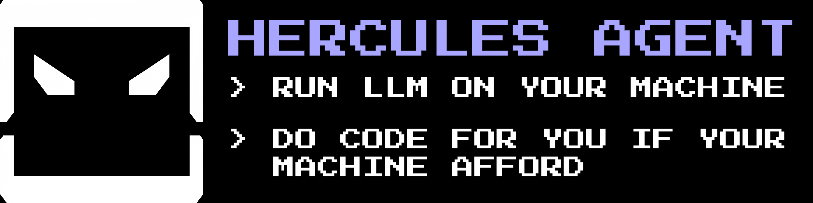
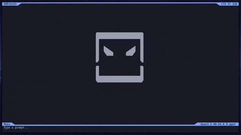

Local coding agent with a terminal UI. It runs models on your machine,
gives the model real tools (files, shell, web, sub-agents), and renders
everything in a Ratatui TUI with tool chips, fly-out panels, and a code
graph.

Working name / crate: `hercules-agent`. Binary: `hercules`.

## Demo



## Getting started

### 1. Install with one line

Linux / macOS (installs user-local under `~/.local`, no sudo):

```sh
curl -fsSL https://raw.githubusercontent.com/CosmoBunny/hercules-agent/main/install.sh | bash
```

Windows PowerShell (installs under `%LOCALAPPDATA%\hercules-agent`, no admin):

```powershell
irm https://raw.githubusercontent.com/CosmoBunny/hercules-agent/main/install.ps1 | iex
```

The script detects your OS, CPU and GPU and picks the right package
(`normal`, `nvidia` or `amd` build). Override with `--nvidia` / `--amd` /
`--cpu` on Linux/macOS, or `-Flavor nvidia|amd|normal` on Windows.

Prefer to do it by hand? Download the latest release here:
[CosmoBunny/hercules-agent — Releases](https://github.com/CosmoBunny/hercules-agent/releases/latest)

Pick the `hercules-agent-<version>-<os>-<arch>.tar.gz` file for your
machine (`nvidia` / `amd` in the name means a GPU build, e.g.
`hercules-agent-nvidia-<version>-linux-x86_64.tar.gz`). macOS ships one
build (`macos-aarch64`, Metal acceleration included). Extract it and run
the `hercules` binary inside `bin/`.

### 2. Download an LLM model

Press **F2** to open the Registry menu, type a model name to search,
navigate with the **↑/↓** arrow keys, and press **Enter** to download.

> **Caution:** Instruct models may ignore the system tool instructions —
> prefer a tool-capable chat model.


### 3. Select the model

After the download finishes, press **F3** to open the Model menu and
select the model you just downloaded.


### 4. Configuration (optional)


- **Power Mode** — how much power to spend on this AI model.
- **MTP** — multi-token prediction: extra prediction of the next tokens
  at the cost of RAM usage and precision.
- **Auto Collapse** — when enabled, every Agent response collapses the
  previous label.
- **Target FPS** — increase for smoother-feeling animation.
- **Stall Time** — watchdog against worst cases like the AI getting stuck
  on prefill.
- **Repeat Detector** — detects consecutive repeated text when the AI
  hallucinates/loops, and notifies the AI about the repetition.
- **Context Window** — lowers KV-cache demand. In the worst case the OS
  may kill the process for system safety, so decreasing this can prevent
  crashes.
- **Permission** — allow the AI to act and control directory access.
  Default is always allow.
- **Web Search** — which web provider the AI may use for online search.
  Default is DuckDuckGo.
- **HF Token** — if Hugging Face searches return empty (rate limiting),
  create a Hugging Face token and paste it here to avoid the error.
- **OCR Engine** — Auto / Tesseract / Native / pdftotext for reading
  text out of attached images and PDFs.
- **Code Graph / LSP Diagnostics** — F6 code-graph panel and which
  language-server diagnostics to surface in it.
- **App Style / Color Palette** — chrome style (Modern, BorderLine,
  None) plus palettes (Rose Pine, Catppuccin, Tokyo Night, Gruvbox,
  Custom, Simple).
- **Auto Compact** — master switch plus CTX-meter threshold (75–95%,
  default 80%) for automatic semantic context compaction.

## Backends and model formats

Implemented today:

- **llama.cpp** (`llama-server` HTTP) — GGUF, incl. vision models with
  `mmproj` weights, for practical local inference.
- **Ollama** daemon (local HTTP) — whatever the daemon serves, incl.
  vision models (`llava`, `qwen2-vl`, …).
- **llama.rs** — pure-Rust GGUF path (no C/FFI; still maturing).

On the roadmap as resolver capability entries (the model picker already
explains compatibility precisely): **Transformers** (SafeTensors, HF
layout), **MLX** (SafeTensors, MLX layout, Apple Silicon only),
**OpenAI-compatible** endpoints (vLLM, LM Studio, …), and **Shared
Thunder** (a paired peer's model over the encrypted Thunder protocol).

The in-app Registry downloads **GGUF** weights. Repos that ship only
SafeTensors/PyTorch weights are rejected with a message that says so —
pick a GGUF quant from the same model family instead.

## What the agent can do

- **Tools**: `write` / `cmd` / `read` (incl. `line="45-55"` ranges) /
  `ls` / `mcp` / `skill` / `websearch` / sub-`agent` / `memory`, parsed
  from the model stream through a canonical parser with exactly-once
  dispatch — a chip is display only, never authority.
- **Permissions**: Ask mode (approve with Y / Enter / N, or A for the
  session) vs Always Allow, plus Current-Dir vs All-Dirs scope (`/allow`).
- **Sub-agent swarm** (`/swarm`) with bounded depth for parallel work.
- **MCP tools** — configure command-based tools in settings.
- **Web search** — DuckDuckGo, Google, Brave, Tavily, SearXNG, ArXiv.
- **Vision**: paste/attach images, OCR them, and reason over them with a
  vision model; optional image generation (SD WebUI, Ollama, diffusers)
  and video generation (AnimateDiff, CogVideoX).
- **Sessions**: `/save` / `/load`, resume, `/copy` chat export.
- **Context management**: `/compact` (manual) plus auto-compact driven
  by the CTX meter; stall watchdog and repeat-loop detector keep runs
  from wedging.
- **Background jobs**: task manager for long-running shell commands
  (`/tasks`).
- **Shared Thunder**: encrypted P2P inference sharing (identity →
  pairing → ...) — inference only, never filesystem, shell, or tools.

## TUI essentials

- Tool chips with kind badges (`WROTE file +45 -3`, `READ file
  [45,55]`, `RAN cmd 34s` / `RUN cmd 45s`) — click to expand inline or
  open the fly-out panel.
- Input completion: `/commands`, `@paths`, `$CURRENT`, model names.
- F6 code graph with LSP diagnostics; F2 registry; F3 models.
- Slash commands: `/help` `/allow` `/swarm` `/compact` (`/gc`,
  `/compact!`) `/tasks` `/save` `/load` `/copy` `/theme`
  `/download-status` and more.

## Build

```bash
cargo build --release
./target/release/hercules
```

Debug:

```bash
cargo run
```

Requires a recent Rust toolchain (edition 2024).

### llama.cpp track

Install `llama-server` on `PATH` (or under `/opt/llama.cpp`). Prefer a build
matched to your CPU (AVX2-only machines must not use AVX-512 binaries).

Optional:

```bash
export HERCULES_N_GPU_LAYERS=0   # force CPU
export HERCULES_CTX=8192
```

### Ollama track

Run `ollama serve` and pick an Ollama model from the menu.

## Project layout

```
src/
  main.rs          # binary entry
  app.rs           # TUI
  agent.rs         # tools + system prompt
  backend.rs       # backends (llama.cpp, Ollama, …)
  model/           # registry, resolver, formats, hardware caps
  thunder/         # encrypted P2P inference sharing
  llama/           # llama.rs + llama-server client
  compact.rs       # semantic context compaction
  complete.rs      # input completion engine
  code_graph.rs    # F6 code graph
  lsp.rs           # language-server diagnostics
  ocr.rs / media.rs / graphic.rs  # vision + attachments + image/video gen
  mcp.rs           # command-based tools
  smart_system.rs  # optimistic file consistency + revisions
  agent_io.rs      # agent I/O scheduler + filesystem sandbox
  settings.rs      # runtime settings
  ...
```

## License

MIT. See [LICENSE](LICENSE).
